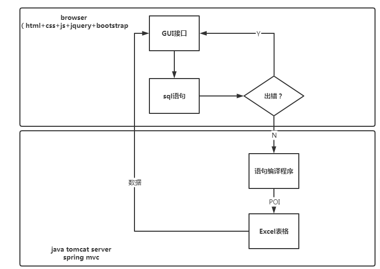
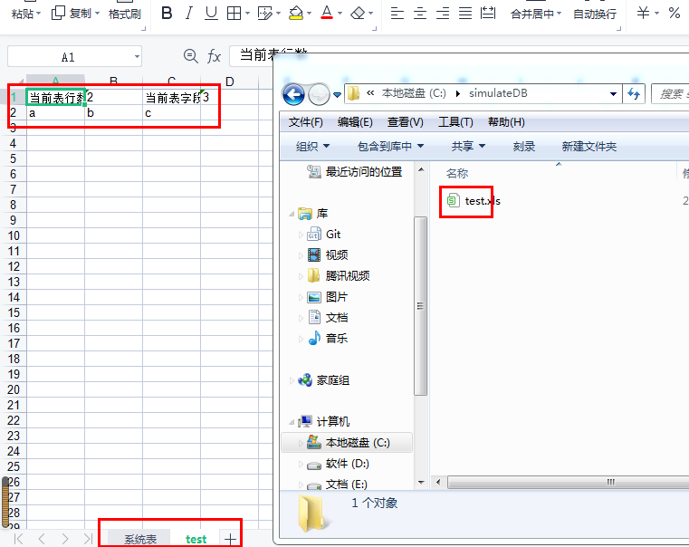
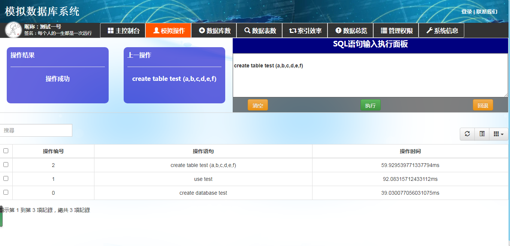

---
模拟数据库的Java POI实现

---

[toc]

># ==选题综述==
>
>模拟数据库设计，主要完成需求分析、概念设计与逻辑设计**


## 课题要求

>>**项目要求**：自由一组，经阅读文献了解知识后，设计需求，设计数据库，==根据项目实际描述进行分析、设计==
>>**课题要求**：
>>（1）设计方案要合理；
>>（2）能基于该方案完成系统要求的功能；
>>（3）设计方案有一定的合理性分析。


# 预期实现



# 一、工具依赖

1. Java JDK1.8、Java Spring套件，python套件，python xlrd,xlwt库

2. wps office、Hbuilder、pycharm、notepad++

3. 项目地址：

   github: [](https://github.com/TonyTang-dev/simulateDatabase_POI_Excel.git)

   gitee:[](https://gitee.com/TangGarlic/simulateDatabase_POI_Excel.git)
   
   本项目目前包括Java版和python版，python版暂时停止维护，pythonGUI基于wxpythonGUI套件库

# 二、技术依赖

1. java spring
2. java poi excle操作库

# 三、分析实现

## 0. 问题分析

- 需要实现数据库创建、创建表、数据库表增删改查、建立索引并比较效果等；
- 分析实现模拟数据库，并实现效率分析；
- 主要难题：搭建索引并作效率分析

## 1、数据库设计实现

### 1.0 初步分析设计

>根据如上分析，需要设计至少如下表，得出如下结论

1. 采用B/S模式实现系统，浏览器发送用户操作语句，java后台接受操作并作出响应；
2. 将数据库转换为.xlsx存储；
3. 将数据库表转换为sheet存储；
4. 每个数据库都有一个“系统表”，用于存储数据库基本信息；
5. 每个数据库表sheet，第一行存储数据库表项数+字段数---->便于增删改查操作；
6. 默认在`C:\\simulateDB\\`路径下创建数据库文件；



**当前缺陷：**

1. 时间原因，暂时只实现：创建数据库、选择数据库、添加数据库表、插入数据、删除数据
2. Java版本当前实现进度：create语句、use语句、insert语句、delete语句···正逐步优化

## 2.系统逻辑设计

### 2.1 实现语句

实现通过识别sql语句实现，实现如下语句：

1. create database [database_name] 创建数据库，例：

   ```mysql
   create database test
   ```

   

2. use [database_name] 使用数据库，例如：

   ```mysql
   use test
   ```

   

3. create table [table_name] (values) 创建数据库表,例如:

   ```mysql
   create table test
   ```

   

4. delete from [table_name] {where [condition]} 删除数据库表数据，包括删除整个表和选定条目删除，例如：

   ```mysql
   delete from test          /     delete from test where a=1
   ```

   

5. insert into [table_name] (values) 向数据库表插入数据，插入数目与字段数一致，例如：

   ```mysql
   insert into test (1,2,3,4,5,6)
   ```

   

# 四、技术实现

## 1. 综述

1. 通过B/S模式设计实现，浏览器获取用户输入之后，向java后台发出请求；
2. 后台识别解析sql语句，进入正确的数据库操作；
3. 执行excel模拟数据库操作响应；
4. 保存模拟数据库操作；
5. 返回操作结果，操作结束；

## 2. 实现效果


  

# 五、问题综述

1. 暂未兼容报错，如用户不合法输入，暂时处理未完全；
3. 索引暂未实现;
4. 项目因为未配置阿里云镜像，直接下载poi配置暂未成功，因此直接手动添加的jar包依赖；

# 六、项目总结

暂无

# 七、参考文献

暂无

# 附录

附录一：初始化数据库所用脚本

```java
package com.dbLab.dao;

import java.io.*;

import com.dbLab.utils.DBUtils;
import org.apache.poi.hssf.usermodel.HSSFCell;
import org.apache.poi.hssf.usermodel.HSSFRow;
import org.apache.poi.hssf.usermodel.HSSFSheet;
import org.apache.poi.hssf.usermodel.HSSFWorkbook;


//进行数据库操作的函数
public class sysDao {
	/*创建数据库--新建一个.xls表*/
	public boolean createDatabase(String baseName){
		File file=new File(baseName+".xls");
		if(!file.exists()){
			System.out.println("正在创建数据库");
		}
//		InputStream is=null;
		HSSFWorkbook wb = null;
		try {
			if (!file.exists()) {
//				is = new FileInputStream(file);
				wb = new HSSFWorkbook();
				wb.createSheet("系统表");
				FileOutputStream fileOut = new FileOutputStream(baseName+"3.xls");//创建文件流
				wb.write(fileOut);//把Workbook对象输出到路径path中
				fileOut.close();
			} else {
				return false;
			}
//			is.close();
			return true;
		}catch(Exception e){
			e.printStackTrace();
			return false;
		}
	}
	/*选择数据库*/
	public boolean selectDatabase(String baseName){
		globalCmd.curDatabase = baseName;
		return true;
	}

	/*在数据库创建表*/
	public boolean createTable(String tableName, String value[]){
		HSSFWorkbook conn = null;
		try {
			conn = new DBUtils().getWrokbook(globalCmd.curDatabase);
		}catch(Exception e){
			System.out.println("打开数据库出错");
			return false;
		}
		HSSFSheet sheet=conn.createSheet(tableName);

		HSSFRow currow = sheet.createRow(0);
		HSSFCell cell=null;
		/*首行存储行数和字段数*/
		cell=currow.createCell(0);
		cell.setCellValue("当前表行数");     //设置cell浮点类型的值
		cell.setCellType(HSSFCell.CELL_TYPE_STRING);
		cell=currow.createCell(1);
		cell.setCellValue("2");   //设置cell字符类型的值
		cell.setCellType(HSSFCell.CELL_TYPE_STRING);
		cell=currow.createCell(2);
		cell.setCellValue("当前表字段数");     //设置cell浮点类型的值
		cell.setCellType(HSSFCell.CELL_TYPE_STRING);
		cell=currow.createCell(3);
		cell.setCellValue(String.valueOf(value.length));   //设置cell字符类型的值
		cell.setCellType(HSSFCell.CELL_TYPE_STRING);

//		写入字段
		currow = sheet.createRow(1);
		for(int i=0;i<value.length;i++){
			cell=currow.createCell(i);
			cell.setCellValue(value[i]);   //设置cell字符类型的值
			cell.setCellType(HSSFCell.CELL_TYPE_STRING);
		}
		try {
			FileOutputStream fileOut = new FileOutputStream(globalCmd.curDatabase + ".xls");

			conn.write(fileOut);
			fileOut.close();
		}catch(Exception e){
			System.out.println("修改数据库出错");
		}
		return true;
	}

	//判断端口是否已经被占用
	public boolean isPort(int port) throws IOException
	{

		boolean bok=false;

		HSSFWorkbook conn=new DBUtils().getWrokbook("String baseName");

		try {
			for (int i=0;i<3;i++) {
				HSSFSheet sheet=conn.getSheetAt(i);
				int num=sheet.getLastRowNum();
				if(sheet.getRow(0)==null) {//第一行是空就代表没有数据了，更不能用getCell了
//					return false;
					continue;
				}
				for (int j=0;j<=num;j++) {
					HSSFRow row = sheet.getRow(j);
					if(String.valueOf(port).equals(String.valueOf(row.getCell(4).getStringCellValue()))) {
						return true;
					}
				}
			}
		}catch(Exception e)
		{
			e.printStackTrace();

		}
		return bok;
	}
}
/**
	 * @description: java poi simulate database
	 * @author: CQU dbLab group Tang&Guo 
	 * @date: 2022/5/24 20:49
	 * @param: [tableName, cmd, params]
	 * @return: boolean
	 **/
	public boolean deleteTable(String tableName, int cmd, String params[]){
		HSSFWorkbook conn = null;
		try {
			conn = dbUtils.getWrokbook(globalCmd.curDatabase);
			if(conn == null){
				return false;
			}
		}catch(Exception e){
			e.printStackTrace();
		}
		HSSFSheet sheet = conn.getSheet(tableName);
		int rowIndex = sheet.getLastRowNum()+1;
//		删除整个表
		if(cmd == 1){
			for(int i=2;i<rowIndex;i++){
				sheet.shiftRows(3,sheet.getLastRowNum()+1,-1);
			}
			try {
				FileOutputStream fileOut = new FileOutputStream(globalCmd.curDatabase + ".xls");

				conn.write(fileOut);
				fileOut.close();
			}catch(Exception e){
				System.out.println("修改数据库出错");
			}
			return true;
		}
		else if(cmd == 2){
			int j=0;
			for(j=0;j<Integer.parseInt(sheet.getRow(0).getCell(3).getStringCellValue());j++){
				if(params[0].equals(sheet.getRow(1).getCell(j).getStringCellValue())){
					break;
				}
			}
			for(int i=2;i<rowIndex;i++){
				if(params[1].equals(sheet.getRow(i).getCell(j).getStringCellValue())){
//					相等说明找到了
					sheet.shiftRows(i+1,sheet.getLastRowNum(),-1);
					try {
						FileOutputStream fileOut = new FileOutputStream(globalCmd.curDatabase + ".xls");

						conn.write(fileOut);
						fileOut.close();
					}catch(Exception e){
						System.out.println("修改数据库出错");
					}
					return true;
				}
			}
		}
		return false;
	}
```

